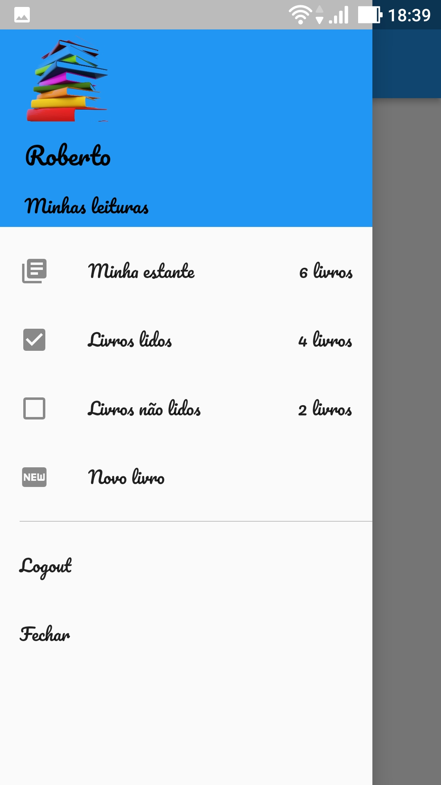
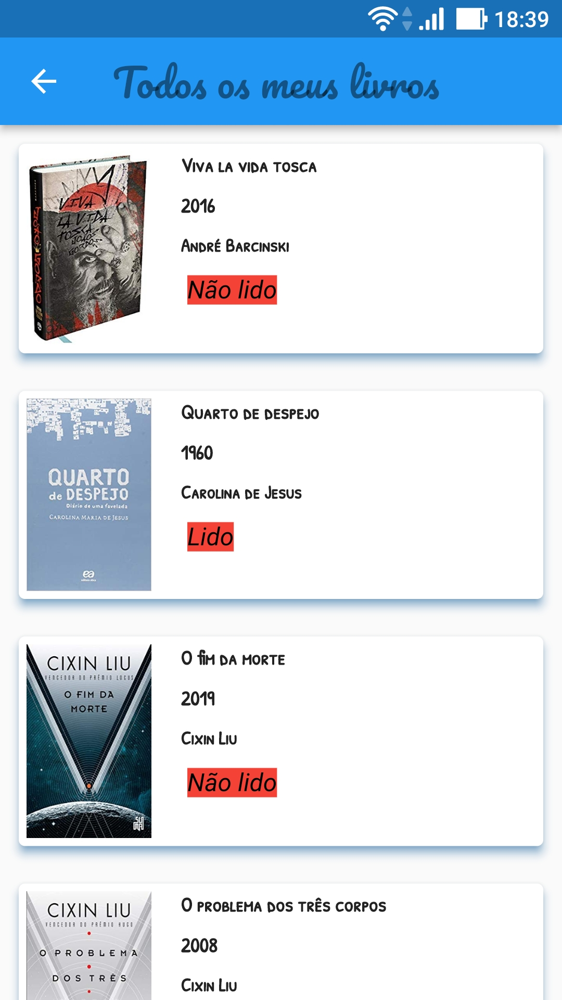
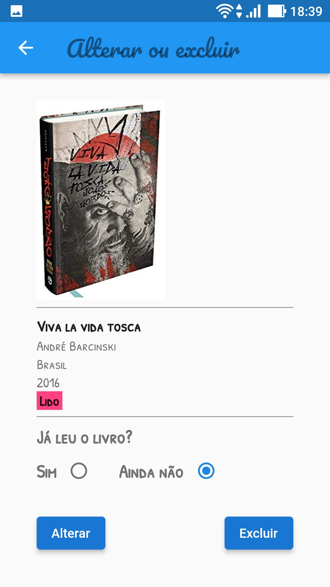

# My Books

I developed this app to manage my books, and I really liked the result.

This application uses as backend, an api developed with Node.js and a Postgres database.
 
 

## 📋 Features

- [x] User login
- [x] Registration of books with cover image
- [x] Show all books
- [x] Show only read books
- [x] Show only unread books
- [x] Mark book as read or unread
- [x] Delete book
       
       

## 🛠 Technologies

### The following tools were used in the construction of the project:

- [Flutter](https://flutter.dev/)
- [Modular](https://modular.flutterando.com.br/)
- [Triple](https://pub.dev/packages/flutter_triple)
- [Dio](https://pub.dev/packages/dio)
- [Secure storage](https://pub.dev/packages/flutter_secure_storage)
- [Validatorless](https://pub.dev/packages/validatorless)
- [Asuka](https://pub.dev/packages/asuka)
- [Image Picker](https://pub.dev/packages/image_picker)
- [Dotenv](https://pub.dev/packages/flutter_dotenv)
- [Clean Architeture](https://github.com/Flutterando/Clean-Dart)

 
 

## 📸 Screenshot of pages:

 

